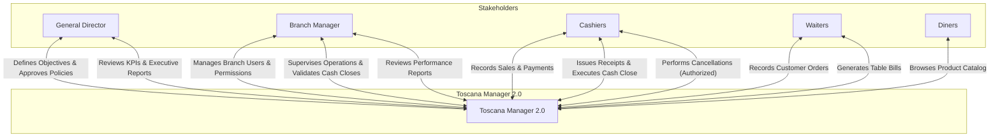

# **Vision and Scope Document - Toscana Manager 2.0 (V5.0)**

## **1. Introduction**

This document describes the **vision** and **scope** of "Toscana Manager 2.0", a system to support the operations and administrative control of "La Toscana", focusing on **security**, **traceability**, **sales**, **catalog**, **suppliers**, and **reporting**, reducing the risks of tampering and losses due to lack of control.

## **2. Business context**

### 2.2 Company needs

| ID  | Need description |
| --- | --- |
| NEC-01 | Manage **multiple branches (12)** with information separated by branch, while maintaining corporate standardization. |
| NEC-02 | Control system access through **roles and permissions**, including branch-level permissions (e.g., a cashier from Branch A cannot see Branch B). |
| NEC-03 | Record **sensitive actions** (sales, cancellations, discounts, adjustments, cash closes) with date, time, and responsible user (audit). |
| NEC-04 | Record sales while preventing alterations or unrecorded sales. |
| NEC-05 | Allow sales with **multiple payment methods (debit/credit cards and cash)** and control discounts under authorization. |
| NEC-06 | Generate a **ticket/receipt** as evidence per transaction. |
| NEC-07 | Manage the product catalog (creates, logical deletes, updates, and queries) in a reliable and traceable way. |
| NEC-08 | Manage suppliers (registration, updates, and logical deletes) by centralizing information. |
| NEC-09 | Enable the owner/executive team to view **reports and analytics** for oversight and decision-making. |
| NEC-10 | Automatically generate **weekly reports** (per branch and corporate consolidated). |
| NEC-11 | (Desirable) Consolidate sales/cash information per branch at the corporate level for auditing and follow-up. |

### 2.3 CURRENT BUSINESS PROCESSES

| ID  | Process name | Description |
| --- | --- | --- |
| PROC-1 | Branch sales | The cashier records sales manually. There is no cross-validation. |
| PROC-2 | Inventory control | Manual counts are done per branch with no synchronization. |
| PROC-3 | Cash close | Done in a spreadsheet and sent by email. |
| PROC-4 | Staff management | Shifts are assigned on paper or in Excel. |
| PROC-5 | Reporting | Management consolidates information manually. |
| PROC-6 | Supplier management and contact | Suppliers are contacted manually and scheduled in a contact list. |
| PROC-7 | Product promotion and inquiry | Products sold are communicated via social media and in the establishments. |

## **3. Solution vision**

### 3.1 Vision statement (aligned to corporate)

**"Toscana Manager 2.0 will be a corporate point-of-sale and operational control platform that connects the 12 branches, with roles and auditing to ensure traceability, and with automated weekly reports to support executive oversight and decision-making."**

### 3.2 Key future processes (TO-BE) - multi-branch adjustments

| Process ID | Process name | Description and main steps |
| --- | --- | --- |
| TOBE-01 | Controlled branch sales (POS) | The sale is recorded at the branch, a unique folio is generated, payments are captured, discounts are applied according to permissions, and a ticket/receipt is issued. |
| TOBE-02 | Corporate access control | Users and permissions can be defined with **branch-level** scope and by role. |
| TOBE-03 | Corporate auditing | Sensitive actions are recorded and can be consulted by management/executives. |
| TOBE-04 | Central catalog with branch applicability | Products can be managed centrally and made available per branch (according to rules). |
| TOBE-05 | Automated weekly reporting | Each week the system generates per-branch reports and a corporate consolidated report. |

### 3.3 High-level capabilities (Epics) - integrating multi-branch and reporting

| ID  | Description and capability | Priority | Associated business process |
| --- | --- | --- | --- |
| EP-01 | Multi-branch management   Create/edit branches, minimal configuration, data segmentation. | High | PROC-1 |
| EP-02 | User, role, and permission management (per branch):   RBAC + branch-level scope (who can see what). | High | PROC-4 |
| EP-03 | Sales, payments, and ticketing: Includes multiple payment methods and controlled discounts. | High | PROC-1 |
| EP-04 | Product catalog: Maintain history and consistency. | Medium | PROC-7 |
| EP-05 | Suppliers: Registration/update/logical delete. | Medium | PROC-6 |
| EP-06 | Automated weekly reports (per branch and corporate): Scheduled weekly report, exportable. | High | PROC-5, PROC-3 |

## **4. Project scope**

### In scope (priority)

- Multi-branch (12): data separation and filters per branch (EP-01)
- Roles/permissions per branch (EP-02)
- Sales, controlled discounts, ticket/receipt (EP-03)
- Product catalog inquiry (EP-04)
- Automated weekly reports (per branch and corporate) (EP-06)

### Out of scope

- Suppliers: Registration/update/logical delete.
- Shift/attendance control
- E-commerce / online store

## **5. System context**

### Stakeholders summary

| Name | Description | Responsibilities |
| --- | --- | --- |
| General Director | Approves software implementation strategies | - Define and approve system objectives (sales, control, service, reports).   - Authorize budget, licenses, infrastructure, and implementation timeline.   - Approve system policies: prices, discounts, roles/permissions, and data security.   - Review KPIs and executive reports for decisions (sales, branches, products). |
| Branch manager | Daily operations; plans and organizes branch resources and teams | - Manage branch users (create/deactivate) and assign role-based permissions.   - Supervise system operations: sales, orders, cancellations, returns.   - Validate cash closes (daily/weekend) and reconcile with recorded sales.   - Review performance reports (sales by shift/product/cashier) and take action. |
| Cashiers | Record day-to-day sales in the system. The assigned cashier performs the cash close on weekends. | - Record sales and issue receipts/tickets (products, quantities, authorized discounts).   - Manage collections and payment methods (cash/card/other) and record payments correctly.   - Perform cancellations/returns only with authorization, leaving reason and evidence.   - Execute the cash close (daily or weekend depending on assignment) and report discrepancies. |
| Waiters | Take customer orders, recording the customer's purchase. | - Record add-ons, changes, or cancellations with a reason and according to permissions/authorization.  - Generate or request the table bill, verify the total, and record service notes (complaints, authorized complimentary items, etc.). |
| Diners | Users who purchase products from the system's product catalog. | - Browse the catalog (products, prices, availability, promotions). |

### Operating environment

- **Users:** ~250
- **Hours:** 6:00 to 23:00
- **Platform:** Web + Tablet
- **Architectural Model (Local-First):** To mitigate internet outages, the system will operate primarily against a lightweight local database on each branch server. This ensures sales never stop.
- **Synchronization Protocol:**
  - **Up-Sync (Upload):** Transactions (sales, cash closes) will be sent to the cloud via asynchronous message queues. In case of disconnection, the system will automatically retry every 5 minutes until receipt is confirmed.
  - **Down-Sync (Download):** Catalog or price updates will be downloaded on demand or during nightly maintenance windows to avoid locking conflicts during operations.
- **Conflict Resolution:** In case of inventory discrepancies between cloud and local, the transaction with the most recent timestamp recorded by the local server will prevail.
- **Integrations:** POS terminals, printers, barcode scanners (optional for the future if shift control, invoicing, e-commerce, fraud detection, etc. are implemented).

### Quality attributes

- **Performance:** The system must respond in under 2 seconds for sales transactions. Weekend report generation must take under 30 seconds.
- **Security:** role- and permission-based access control; branch-level segregation; auditing of critical actions.
- **Availability:**
  - **99.9% availability** is required during operating hours (6:00 to 23:00).
  - **RTO (Recovery Time Objective):** In case of a total local server failure, operations must be restorable on a tablet or secondary terminal in under **15 minutes**.
- **Usability:** efficient interface for cashiers and supervision (few steps to complete a sale, clear filters for reports), enabling adaptation in under 5 minutes for basic sales actions (transactions such as sales) and inventory tasks.
